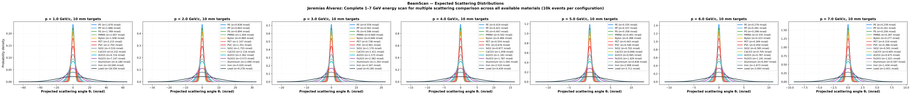
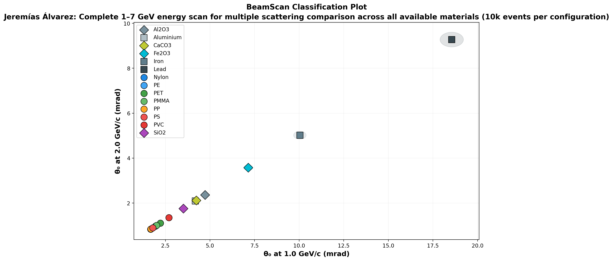

# 🔬 BeamScan Simulation Results

**Author:** Jeremías Álvarez  
**Description:** Complete 1–7 GeV energy scan for multiple scattering comparison across all available materials (10k events per configuration)  
**Generated:** 2026-03-01 00:14 UTC  
**Method:** Highland formula (analytical)

## Beam Settings
- Particle: `e-`
- Momenta: [1.0, 2.0, 3.0, 4.0, 5.0, 6.0, 7.0] GeV/c
- Events requested: 10,000

## Predictions

| Material | p (GeV/c) | θ₀ (mrad) | ΔE (MeV) | X₀ (cm) | Thickness |
|----------|-----------|-----------|----------|---------|----------|
| PE | 1.0 | **1.676** | 1.9 | 47.9 | 10.0 mm |
| PE | 2.0 | **0.838** | 1.9 | 47.9 | 10.0 mm |
| PE | 3.0 | **0.559** | 1.9 | 47.9 | 10.0 mm |
| PE | 4.0 | **0.419** | 1.9 | 47.9 | 10.0 mm |
| PE | 5.0 | **0.335** | 1.9 | 47.9 | 10.0 mm |
| PE | 6.0 | **0.279** | 1.9 | 47.9 | 10.0 mm |
| PE | 7.0 | **0.239** | 1.9 | 47.9 | 10.0 mm |
| PP | 1.0 | **1.686** | 1.8 | 47.4 | 10.0 mm |
| PP | 2.0 | **0.843** | 1.8 | 47.4 | 10.0 mm |
| PP | 3.0 | **0.562** | 1.8 | 47.4 | 10.0 mm |
| PP | 4.0 | **0.421** | 1.8 | 47.4 | 10.0 mm |
| PP | 5.0 | **0.337** | 1.8 | 47.4 | 10.0 mm |
| PP | 6.0 | **0.281** | 1.8 | 47.4 | 10.0 mm |
| PP | 7.0 | **0.241** | 1.8 | 47.4 | 10.0 mm |
| PS | 1.0 | **1.789** | 2.1 | 42.5 | 10.0 mm |
| PS | 2.0 | **0.894** | 2.1 | 42.5 | 10.0 mm |
| PS | 3.0 | **0.596** | 2.1 | 42.5 | 10.0 mm |
| PS | 4.0 | **0.447** | 2.1 | 42.5 | 10.0 mm |
| PS | 5.0 | **0.358** | 2.1 | 42.5 | 10.0 mm |
| PS | 6.0 | **0.298** | 2.1 | 42.5 | 10.0 mm |
| PS | 7.0 | **0.256** | 2.1 | 42.5 | 10.0 mm |
| PMMA | 1.0 | **2.007** | 2.4 | 34.4 | 10.0 mm |
| PMMA | 2.0 | **1.004** | 2.4 | 34.4 | 10.0 mm |
| PMMA | 3.0 | **0.669** | 2.4 | 34.4 | 10.0 mm |
| PMMA | 4.0 | **0.502** | 2.4 | 34.4 | 10.0 mm |
| PMMA | 5.0 | **0.401** | 2.4 | 34.4 | 10.0 mm |
| PMMA | 6.0 | **0.335** | 2.4 | 34.4 | 10.0 mm |
| PMMA | 7.0 | **0.287** | 2.4 | 34.4 | 10.0 mm |
| Nylon | 1.0 | **1.938** | 2.3 | 36.7 | 10.0 mm |
| Nylon | 2.0 | **0.969** | 2.3 | 36.7 | 10.0 mm |
| Nylon | 3.0 | **0.646** | 2.3 | 36.7 | 10.0 mm |
| Nylon | 4.0 | **0.484** | 2.3 | 36.7 | 10.0 mm |
| Nylon | 5.0 | **0.388** | 2.3 | 36.7 | 10.0 mm |
| Nylon | 6.0 | **0.323** | 2.3 | 36.7 | 10.0 mm |
| Nylon | 7.0 | **0.277** | 2.3 | 36.7 | 10.0 mm |
| PET | 1.0 | **2.215** | 2.8 | 28.7 | 10.0 mm |
| PET | 2.0 | **1.107** | 2.8 | 28.7 | 10.0 mm |
| PET | 3.0 | **0.738** | 2.8 | 28.7 | 10.0 mm |
| PET | 4.0 | **0.554** | 2.8 | 28.7 | 10.0 mm |
| PET | 5.0 | **0.443** | 2.8 | 28.7 | 10.0 mm |
| PET | 6.0 | **0.369** | 2.8 | 28.7 | 10.0 mm |
| PET | 7.0 | **0.316** | 2.8 | 28.7 | 10.0 mm |
| PVC | 1.0 | **2.702** | 2.6 | 19.9 | 10.0 mm |
| PVC | 2.0 | **1.351** | 2.6 | 19.9 | 10.0 mm |
| PVC | 3.0 | **0.901** | 2.6 | 19.9 | 10.0 mm |
| PVC | 4.0 | **0.676** | 2.6 | 19.9 | 10.0 mm |
| PVC | 5.0 | **0.540** | 2.6 | 19.9 | 10.0 mm |
| PVC | 6.0 | **0.450** | 2.6 | 19.9 | 10.0 mm |
| PVC | 7.0 | **0.386** | 2.6 | 19.9 | 10.0 mm |
| SiO2 | 1.0 | **3.510** | 4.4 | 12.29 | 10.0 mm |
| SiO2 | 2.0 | **1.755** | 4.4 | 12.29 | 10.0 mm |
| SiO2 | 3.0 | **1.170** | 4.4 | 12.29 | 10.0 mm |
| SiO2 | 4.0 | **0.877** | 4.4 | 12.29 | 10.0 mm |
| SiO2 | 5.0 | **0.702** | 4.4 | 12.29 | 10.0 mm |
| SiO2 | 6.0 | **0.585** | 4.4 | 12.29 | 10.0 mm |
| SiO2 | 7.0 | **0.501** | 4.4 | 12.29 | 10.0 mm |
| CaCO3 | 1.0 | **4.232** | 5.6 | 8.7 | 10.0 mm |
| CaCO3 | 2.0 | **2.116** | 5.6 | 8.7 | 10.0 mm |
| CaCO3 | 3.0 | **1.411** | 5.6 | 8.7 | 10.0 mm |
| CaCO3 | 4.0 | **1.058** | 5.6 | 8.7 | 10.0 mm |
| CaCO3 | 5.0 | **0.846** | 5.6 | 8.7 | 10.0 mm |
| CaCO3 | 6.0 | **0.705** | 5.6 | 8.7 | 10.0 mm |
| CaCO3 | 7.0 | **0.605** | 5.6 | 8.7 | 10.0 mm |
| Al2O3 | 1.0 | **4.724** | 7.9 | 7.1 | 10.0 mm |
| Al2O3 | 2.0 | **2.362** | 7.9 | 7.1 | 10.0 mm |
| Al2O3 | 3.0 | **1.575** | 7.9 | 7.1 | 10.0 mm |
| Al2O3 | 4.0 | **1.181** | 7.9 | 7.1 | 10.0 mm |
| Al2O3 | 5.0 | **0.945** | 7.9 | 7.1 | 10.0 mm |
| Al2O3 | 6.0 | **0.787** | 7.9 | 7.1 | 10.0 mm |
| Al2O3 | 7.0 | **0.675** | 7.9 | 7.1 | 10.0 mm |
| Fe2O3 | 1.0 | **7.147** | 10.5 | 3.3 | 10.0 mm |
| Fe2O3 | 2.0 | **3.573** | 10.5 | 3.3 | 10.0 mm |
| Fe2O3 | 3.0 | **2.382** | 10.5 | 3.3 | 10.0 mm |
| Fe2O3 | 4.0 | **1.787** | 10.5 | 3.3 | 10.0 mm |
| Fe2O3 | 5.0 | **1.429** | 10.5 | 3.3 | 10.0 mm |
| Fe2O3 | 6.0 | **1.191** | 10.5 | 3.3 | 10.0 mm |
| Fe2O3 | 7.0 | **1.021** | 10.5 | 3.3 | 10.0 mm |
| Aluminium | 1.0 | **4.180** | 5.4 | 8.9 | 10.0 mm |
| Aluminium | 2.0 | **2.090** | 5.4 | 8.9 | 10.0 mm |
| Aluminium | 3.0 | **1.393** | 5.4 | 8.9 | 10.0 mm |
| Aluminium | 4.0 | **1.045** | 5.4 | 8.9 | 10.0 mm |
| Aluminium | 5.0 | **0.836** | 5.4 | 8.9 | 10.0 mm |
| Aluminium | 6.0 | **0.697** | 5.4 | 8.9 | 10.0 mm |
| Aluminium | 7.0 | **0.597** | 5.4 | 8.9 | 10.0 mm |
| Iron | 1.0 | **10.040** | 15.7 | 1.757 | 10.0 mm |
| Iron | 2.0 | **5.020** | 15.7 | 1.757 | 10.0 mm |
| Iron | 3.0 | **3.347** | 15.7 | 1.757 | 10.0 mm |
| Iron | 4.0 | **2.510** | 15.7 | 1.757 | 10.0 mm |
| Iron | 5.0 | **2.008** | 15.7 | 1.757 | 10.0 mm |
| Iron | 6.0 | **1.673** | 15.7 | 1.757 | 10.0 mm |
| Iron | 7.0 | **1.434** | 15.7 | 1.757 | 10.0 mm |
| Lead | 1.0 | **18.556** | 22.7 | 0.561 | 10.0 mm |
| Lead | 2.0 | **9.278** | 22.7 | 0.561 | 10.0 mm |
| Lead | 3.0 | **6.185** | 22.7 | 0.561 | 10.0 mm |
| Lead | 4.0 | **4.639** | 22.7 | 0.561 | 10.0 mm |
| Lead | 5.0 | **3.711** | 22.7 | 0.561 | 10.0 mm |
| Lead | 6.0 | **3.093** | 22.7 | 0.561 | 10.0 mm |
| Lead | 7.0 | **2.651** | 22.7 | 0.561 | 10.0 mm |

## Discrimination Power (at 1.0 GeV/c)

Events needed for 3σ separation:

| | PE | PP | PS | PMMA | Nylon | PET | PVC | SiO2 | CaCO3 | Al2O3 | Fe2O3 | Aluminium | Iron | Lead |
|---|---|---|---|---|---|---|---|---|---|---|---|---|---|---|
| **PE** | — | ❌ 551,308 | ✅ 4,248 | ✅ 558 | ✅ 860 | ✅ 235 | ✅ 82 | ✅ 36 | ✅ 25 | ✅ 20 | ✅ 12 | ✅ 25 | ✅ 9 | ✅ 7 |
| **PP** | ❌ 551,308 | — | ⚠️ 5,104 | ✅ 595 | ✅ 932 | ✅ 245 | ✅ 84 | ✅ 37 | ✅ 25 | ✅ 21 | ✅ 12 | ✅ 25 | ✅ 9 | ✅ 7 |
| **PS** | ✅ 4,248 | ⚠️ 5,104 | — | ✅ 1,363 | ✅ 2,827 | ✅ 398 | ✅ 109 | ✅ 43 | ✅ 28 | ✅ 23 | ✅ 13 | ✅ 29 | ✅ 10 | ✅ 7 |
| **PMMA** | ✅ 558 | ✅ 595 | ✅ 1,363 | — | ⚠️ 14,526 | ✅ 1,859 | ✅ 207 | ✅ 61 | ✅ 36 | ✅ 28 | ✅ 15 | ✅ 37 | ✅ 11 | ✅ 7 |
| **Nylon** | ✅ 860 | ✅ 932 | ✅ 2,827 | ⚠️ 14,526 | — | ✅ 1,010 | ✅ 166 | ✅ 55 | ✅ 33 | ✅ 26 | ✅ 14 | ✅ 34 | ✅ 10 | ✅ 7 |
| **PET** | ✅ 235 | ✅ 245 | ✅ 398 | ✅ 1,859 | ✅ 1,010 | — | ✅ 458 | ✅ 88 | ✅ 46 | ✅ 35 | ✅ 17 | ✅ 48 | ✅ 12 | ✅ 8 |
| **PVC** | ✅ 82 | ✅ 84 | ✅ 109 | ✅ 207 | ✅ 166 | ✅ 458 | — | ✅ 267 | ✅ 93 | ✅ 61 | ✅ 23 | ✅ 98 | ✅ 14 | ✅ 9 |
| **SiO2** | ✅ 36 | ✅ 37 | ✅ 43 | ✅ 61 | ✅ 55 | ✅ 88 | ✅ 267 | — | ✅ 517 | ✅ 207 | ✅ 39 | ✅ 592 | ✅ 20 | ✅ 10 |
| **CaCO3** | ✅ 25 | ✅ 25 | ✅ 28 | ✅ 36 | ✅ 33 | ✅ 46 | ✅ 93 | ✅ 517 | — | ✅ 1,491 | ✅ 69 | ❌ 118,872 | ✅ 28 | ✅ 12 |
| **Al2O3** | ✅ 20 | ✅ 21 | ✅ 23 | ✅ 28 | ✅ 26 | ✅ 35 | ✅ 61 | ✅ 207 | ✅ 1,491 | — | ✅ 109 | ✅ 1,207 | ✅ 35 | ✅ 13 |
| **Fe2O3** | ✅ 12 | ✅ 12 | ✅ 13 | ✅ 15 | ✅ 14 | ✅ 17 | ✅ 23 | ✅ 39 | ✅ 69 | ✅ 109 | — | ✅ 66 | ✅ 159 | ✅ 23 |
| **Aluminium** | ✅ 25 | ✅ 25 | ✅ 29 | ✅ 37 | ✅ 34 | ✅ 48 | ✅ 98 | ✅ 592 | ❌ 118,872 | ✅ 1,207 | ✅ 66 | — | ✅ 27 | ✅ 12 |
| **Iron** | ✅ 9 | ✅ 9 | ✅ 10 | ✅ 11 | ✅ 10 | ✅ 12 | ✅ 14 | ✅ 20 | ✅ 28 | ✅ 35 | ✅ 159 | ✅ 27 | — | ✅ 51 |
| **Lead** | ✅ 7 | ✅ 7 | ✅ 7 | ✅ 7 | ✅ 7 | ✅ 8 | ✅ 9 | ✅ 10 | ✅ 12 | ✅ 13 | ✅ 23 | ✅ 12 | ✅ 51 | — |

✅ Easy (<5k events) | ⚠️ Moderate (5k–100k) | ❌ Impractical (>100k)

## Figures

---
*Generated automatically by BeamScan Highland Calculator*
